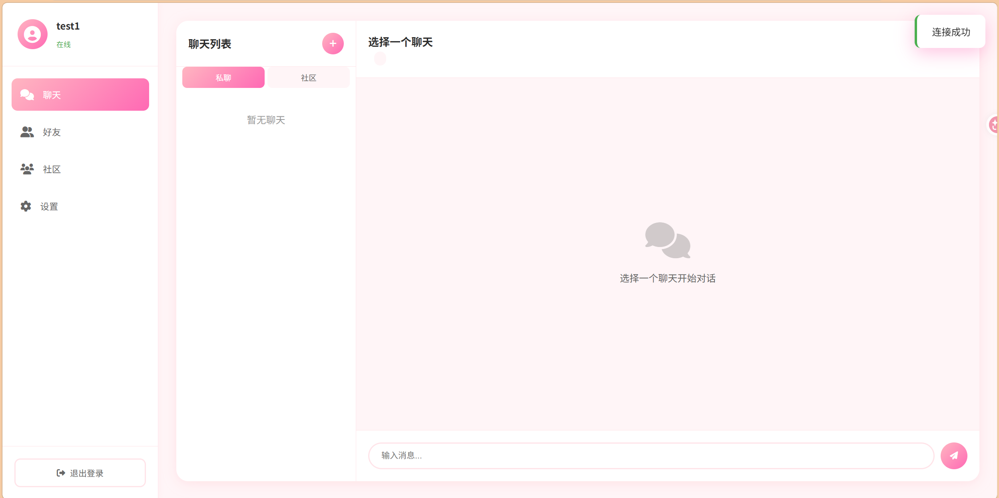
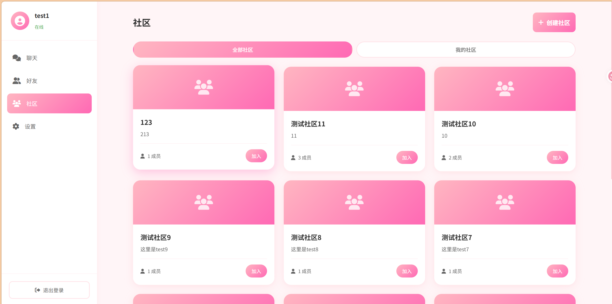

# 多多益善 (DuoDuoYiShan)


## 项目简介

一个基于 Go 语言开发的社交平台，支持实时聊天、好友管理、社区互动等功能，提供实时通信、好友管理、社区互动等核心功能。

## 主要功能

- **用户系统**：注册登录、JWT认证、信息管理
- **即时通讯**：私聊、群聊、实时消息推送(WebSocket)
- **好友管理**：添加好友、处理请求、好友列表
- **社区管理**：创建社区、加入退出、成员管理

## 技术栈

- **后端**：Go 1.25 + Gin + GORM + MySQL + Redis + WebSocket
- **前端**：HTML5 + CSS3 + JavaScript
- **部署**：Docker + Docker Compose
- **测试**：Postman

## 快速开始

### 一、使用 Docker Compose（推荐）

1. 克隆项目
```bash
git clone https://github.com/waterha/duoduoyishan.git
cd duoduoyishan
```

2. 启动服务
```bash
docker-compose up -d
```

3. 访问应用
```
http://localhost:8080
```

### 二、本地运行

1. 安装依赖
```bash
go mod download
```

2. 配置数据库和Redis
编辑 `config/config.yaml` 文件修改连接信息

如：mysql的host username和 redis 的host配置需要修改

3. 运行项目
```bash
go run main.go
```

4. 访问应用
```
http://localhost:8080
```

## 项目结构

```
duoduoyishan/
├── cache/              # Redis 缓存
├── config/             # 配置文件
├── controller/         # 控制器
├── database/           # 数据库连接
├── middleware/         # 中间件
├── models/             # 数据模型
├── router/             # 路由配置
├── service/            # 业务逻辑
├── static/             # 静态文件
├── utils/              # 工具函数
├── websocket_own/      # WebSocket 处理
├── Dockerfile          # Docker 构建文件
├── docker-compose.yml  # Docker Compose 配置
└── main.go             # 程序入口
```

---
## 效果演示






---
**多多益善** - 简约社交，连接你我

**联系方式** 

QQ: 2982607287

邮箱： vickwinwin@outlook.com